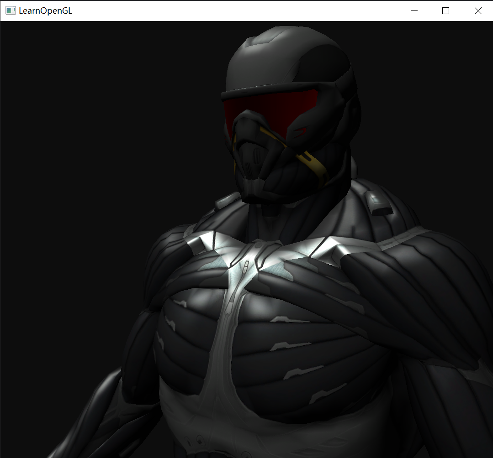
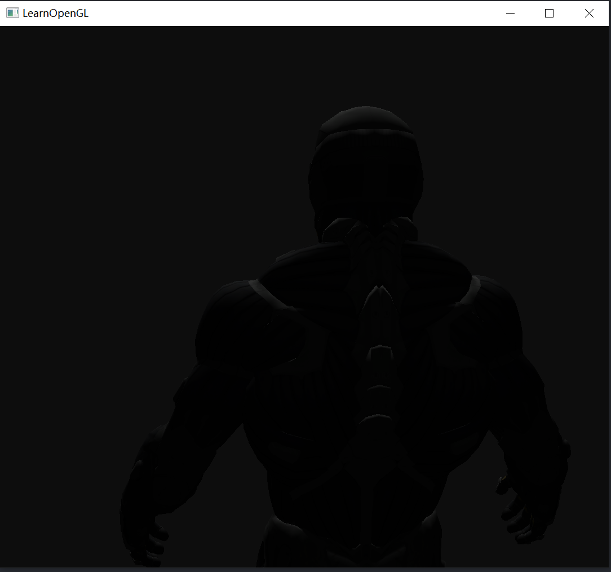
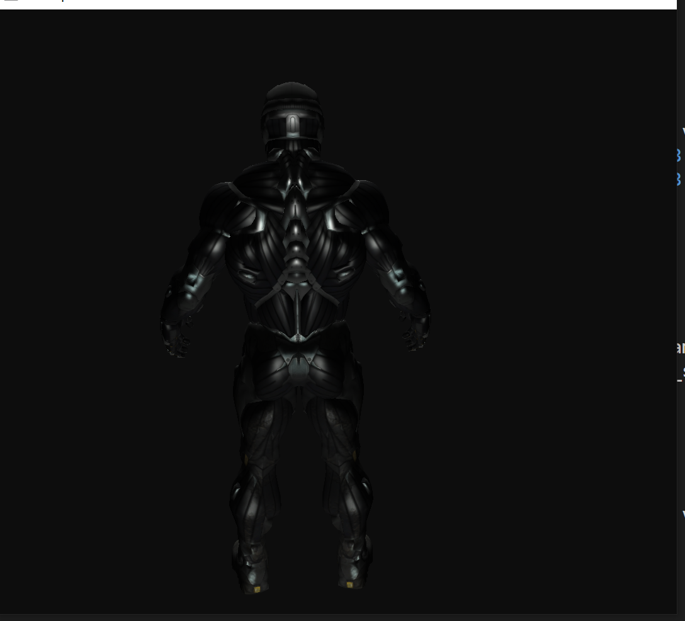
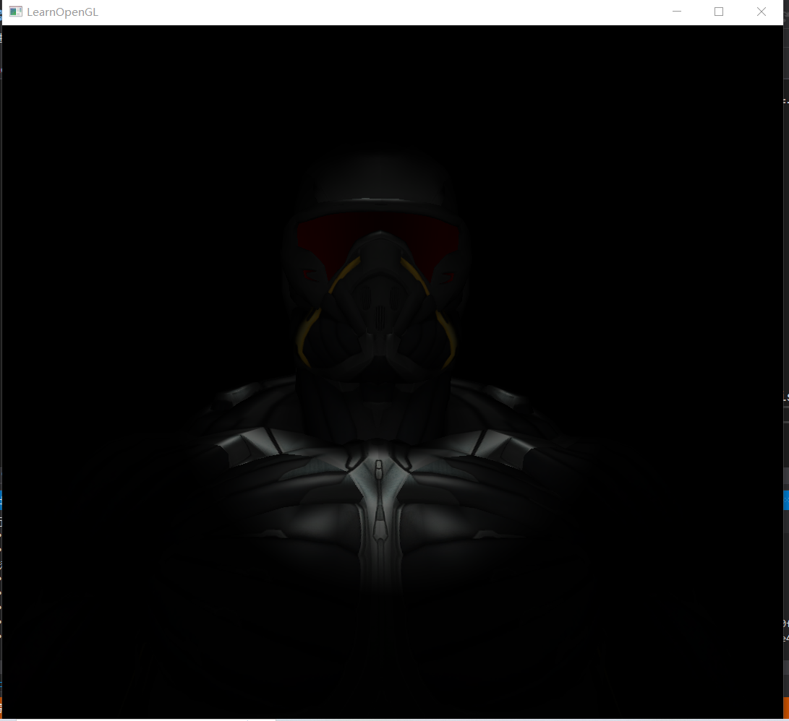
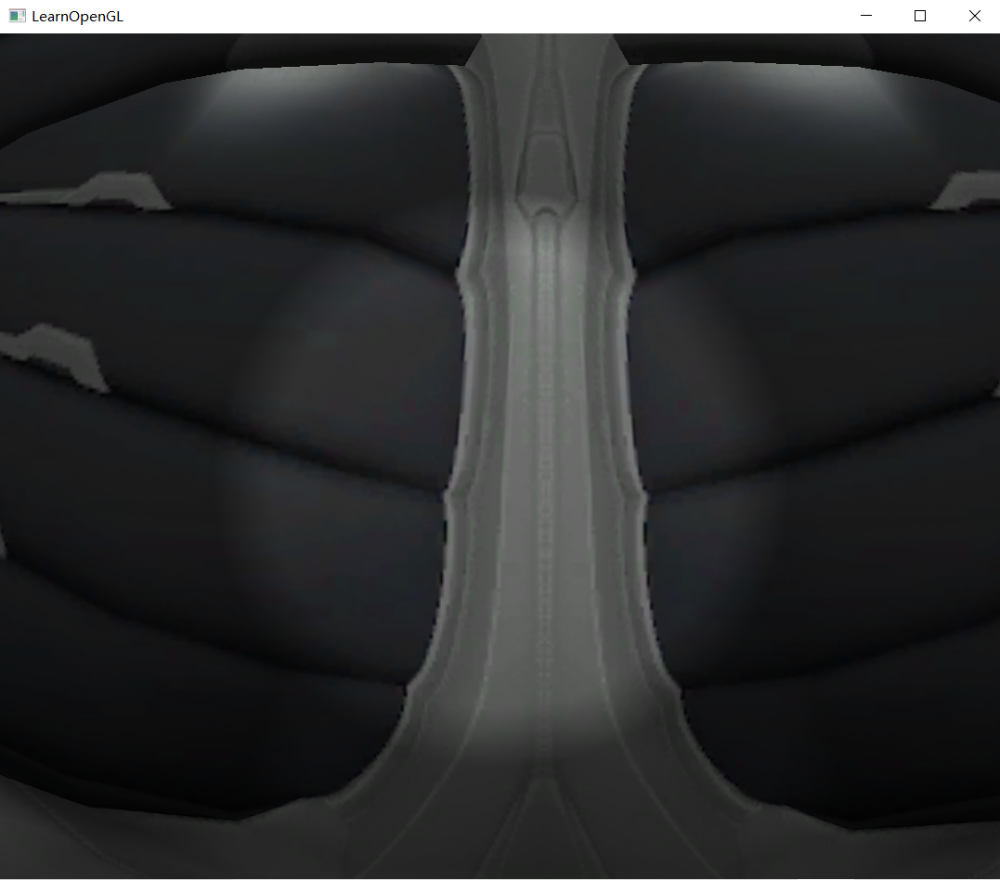

### Opengl 练习

模型加载和不同光源的实现:天空盒，平行光源，点光源，聚光灯

### Assimp 加载模型

```cpp
7
texture_diffuse1
texture_normal1
-----------
texture_diffuse1
texture_specular1
texture_normal1
-----------
texture_diffuse1
texture_specular1
texture_normal1
-----------
texture_diffuse1
texture_normal1
-----------
texture_diffuse1
texture_specular1
texture_normal1
-----------
texture_diffuse1
texture_specular1
texture_normal1
-----------
texture_diffuse1
texture_specular1
texture_normal1
-----------
```

可以看到模型一共分为了7个mesh,不同的mesh有不同数量的贴图，有的有高光贴图，有的具有漫反射贴图，有的具有法线贴图。但是learnopengl中只是采用了一种贴图和简单的shading实现。

```glsl
#version 330 core
out vec4 FragColor;

in vec2 TexCoords;

uniform sampler2D texture_diffuse1;

void main()
{    
    FragColor = texture(texture_diffuse1, TexCoords);
}
```

如何处理不同mesh之间的纹理贴图并不相同：

’‘我们需要为Mesh类定义最后一个函数，它的Draw函数。在真正渲染这个网格之前，我们需要在调用glDrawElements函数之前先绑定相应的纹理。然而，这实际上有些困难，我们一开始并不知道这个网格（如果有的话）有多少纹理、纹理是什么类型的。所以我们该如何在着色器中设置纹理单元和采样器呢？

为了解决这个问题，我们需要设定一个命名标准：每个漫反射纹理被命名为`texture_diffuseN`，每个镜面光纹理应该被命名为`texture_specularN`，其中`N`的范围是1到纹理采样器最大允许的数字。比如说我们对某一个网格有3个漫反射纹理，2个镜面光纹理，它们的纹理采样器应该之后会被调用：

```c++
uniform sampler2D texture_diffuse1;
uniform sampler2D texture_diffuse2;
uniform sampler2D texture_diffuse3;
uniform sampler2D texture_specular1;
uniform sampler2D texture_specular2;
```

根据这个标准，我们可以在着色器中定义任意需要数量的纹理采样器，如果一个网格真的包含了（这么多）纹理，我们也能知道它们的名字是什么。根据这个标准，我们也能在一个网格中处理任意数量的纹理，开发者也可以自由选择需要使用的数量，他只需要定义正确的采样器就可以了（虽然定义少的话会有点浪费绑定和uniform调用）。"---- from learn opengl

```cpp
// render the mesh
    void Draw(Shader& shader)
    {
        // bind appropriate textures
        unsigned int diffuseNr = 1;
        unsigned int specularNr = 1;
        unsigned int normalNr = 1;
        unsigned int heightNr = 1;
        for (unsigned int i = 0; i < textures.size(); i++)
        {
            glActiveTexture(GL_TEXTURE0 + i); // active proper texture unit before binding
            // retrieve texture number (the N in diffuse_textureN)
            string number;
            string name = textures[i].type;
            if (name == "texture_diffuse")
                number = std::to_string(diffuseNr++);
            else if (name == "texture_specular")
                number = std::to_string(specularNr++); // transfer unsigned int to string
            else if (name == "texture_normal")
                number = std::to_string(normalNr++); // transfer unsigned int to string
            else if (name == "texture_height")
                number = std::to_string(heightNr++); // transfer unsigned int to string

            // now set the sampler to the correct texture unit
            //cout << name + number << endl;

            glUniform1i(glGetUniformLocation(shader.ID, (name + number).c_str()), i);
            // and finally bind the texture
            glBindTexture(GL_TEXTURE_2D, textures[i].id);
        }
        //cout << "-----------" << endl;

        // draw mesh
        glBindVertexArray(VAO);
        glDrawElements(GL_TRIANGLES, static_cast<unsigned int>(indices.size()), GL_UNSIGNED_INT, 0);
        glBindVertexArray(0);

        // always good practice to set everything back to defaults once configured.
        glActiveTexture(GL_TEXTURE0);
    }
```

这里默认是至少得有一张贴图并且至少得有一张的漫反射贴图，从fragmentshader中可以看到，并且默认提供的fragment shader 只采用了一张漫反射贴图进行shading。

```glsl
glUniform1i(glGetUniformLocation(shader.ID, (name + number).c_str()), i);
// and finally bind the texture
glBindTexture(GL_TEXTURE_2D, textures[i].id);
```

第一个设置全局变量是为了设置纹理采样器属于哪个纹理单元，第二个是将纹理绑定到纹理单元上，并通过纹理单元最终绑定到纹理采样器中。真绕啊。。。。首先得说明采样器属于哪个纹理单元，然后将纹理绑定到纹理采样器上就是绑到了对应的纹理采样器上了。当然首先还得激活纹理单元。

### 不同数量纹理贴图处理

emmm最困惑我的地方：拥有不同数量的纹理贴图得有不同的shader吧，mesh的处理是让其能够按需使用，至少按照我目前的了解的知识貌似并没有方法能够在一个shader里面处理不同情况，貌似没有办法能够判定一个sample2D是否绑定纹理贴图。例如有无法线贴图的fragment shader的实现就是不同的。但是拥有不同数量的贴图的mesh本就该采用不同的fragment shader但是提供的model是所有的mesh使用同一个shader ,还得先看看有哪些贴图(比如拥有十张漫反射贴图和五张漫反射题图的写法就是不同。。。。)。

那就先考虑有漫反射贴图和镜面贴图的情况。

```cpp
7
texture_diffuse1
texture_normal1
---------
texture_diffuse1
texture_specular1
texture_normal1
-----------
texture_diffuse1
texture_specular1
texture_normal1
-----------
texture_diffuse1
texture_normal1
-----------
texture_diffuse1
texture_specular1
texture_normal1
-----------
texture_diffuse1
texture_specular1
texture_normal1
-----------
texture_diffuse1
texture_specular1
texture_normal1
-----------
```

emmm虽然都有漫反射贴图但是并不是都有高光贴图。emmm统一没有高光贴图的其实还蛮好处理的，没有就传一个1 * 1的全黑的纹理进来或者使用一个uniform变量来判断specular texture map 是否有效。在GPU里面做判断并不是一个良好的习惯emm。

那就先考虑具有漫反射贴图和高光贴图的处理。法线贴图暂时搁置。

### 平行光 点光源 聚光灯

添加位于模型前方的平行光：





在背后添加一个点光源：



加入聚光灯(手电筒)：





##   cubemap environment mapping


