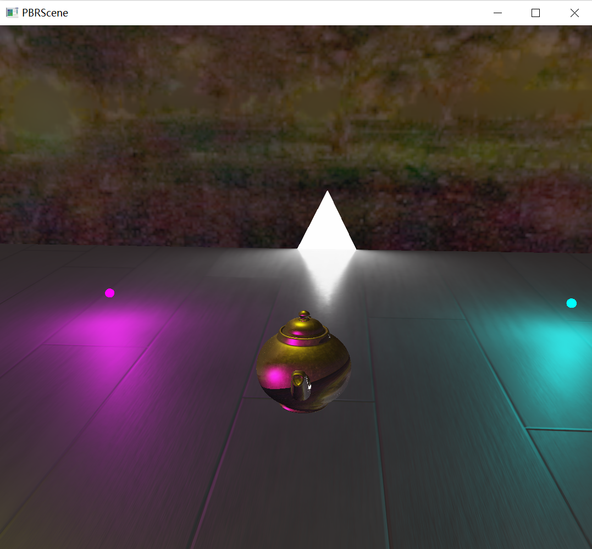
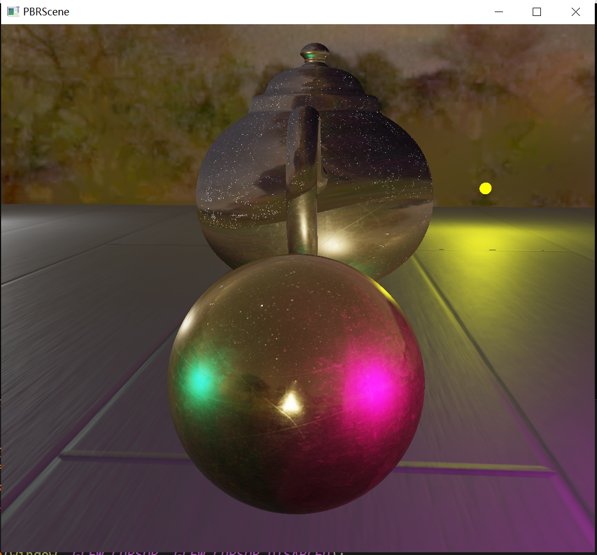

### PBR scene

基于OpenGL实现PBR场景渲染。在场景中生成物体，并绑定PBR贴图，通过基于辐射度量学的光照和Cook Torrance的PBR材质，实现场景中点光源对物体表面的着色。通过split sum方法将渲染方程中的漫反射项、specular light以及BRDF项从反射方程中拆开并预计算贴图，实现image based lighting,并通过物体表面的AO贴图实现环境光遮蔽。并且，使用linear transfer cosine 方法实现三角形光源对PBR材质的着色。主要实现了：

1. Cook Torrance PBR 材质
2. 基于split sum的环境光映射
3. Linear transfer cosine 的三角形光源着色

### Reference

- **Linear Transformed Cosines(LTC)**: [Real-time polygonal-light shading with linearly transformed cosines](https://eheitzresearch.wordpress.com/415-2/)  
- **Rectangle light**: [Real-Time Area Lighting: a Journey from Research to Production](https://blog.selfshadow.com/publications/s2016-advances/s2016_ltc_rnd.pdf)  
- **IBL**:[LearnOpenGL](https://learnopengl.com/)